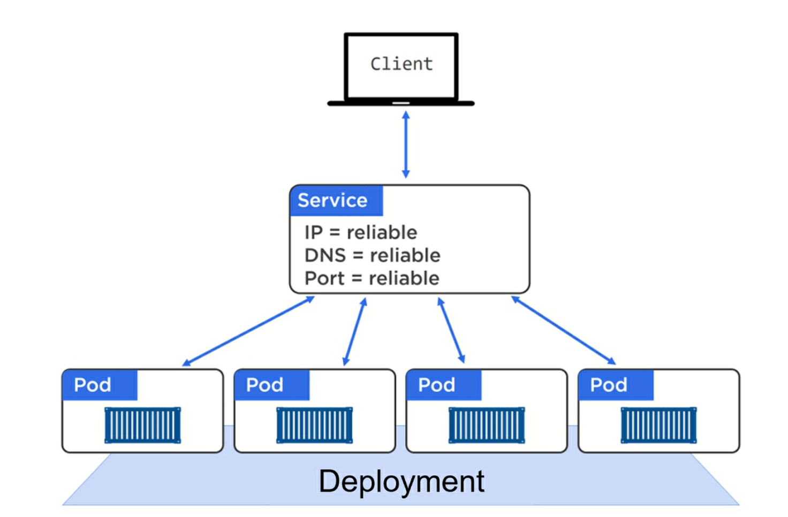

name: splash
layout: true
class: center, middle, inverse

---
count:false
# Kubernetes - Sistema Operacional Distribuido

# by [@famsbh](http://twitter.com/famsbh)

---
layout: true
count:false
name: sessao
class: left, center, inverse
#.logo-linux[]

---
layout: true
name: conteudo
count:false
class: left, top
.logo-linux[]

---
template: splash
# Dia 2

---
template:conteudo

# ReplicaSet
- Gerencia Copias de pods
  - mantem X copias em execução
  - recria em caso de morte
  - deleta em processos de autoscale

---
# Replicaset YAML
```yaml
apiVersion: apps/v1
kind: ReplicaSet
metadata:
  name: frontend
  labels:
    app: contador
    tier: frontend
spec:
  # Replicas
  replicas: 3
  selector:
    matchLabels:
      tier: frontend
  template:
    metadata:
      labels:
        tier: frontend
    spec:
      containers:
      - name: contador-python
        image: fams/contador:latest
        ports:
        - containerPort: 5000
          protocol: TCP
```

---
#ReplicaSet kubectl
### Criando pods com o RS
```bash
kubectl create -f contador-rs.yaml
kubectl get rs
kubectl get pods -l tier=frontend
```

--
### Entendendo os seletores
```bash
kubectl delete rs frontend
kubectl create -d nginx-frontend
kubectl get pods
kubectl create -f contador-rs.yaml
kubectl get pods
```

---
# Acessando app
### Nossa aplicação espera um redis

```yaml
apiVersion: v1
kind: Pod
metadata:
  name: redis
  labels:
    name: redis
    tier: backend
    app: redis
spec:
  containers:
  - name: redis
    image: redis
    ports:
    - containerPort: 6379
```

---
# Necessário um serviço para o acesso
```bash
kind: Service
apiVersion: v1
metadata:
  name: redis
spec:
  selector:
    app: redis
  ports:
  - protocol: TCP
    port: 6379
    targetPort: 6379
```

---
# Aplicacao com acesso ao redis
```yaml
apiVersion: apps/v1
kind: ReplicaSet
metadata:
  name: frontend
  labels:
    app: contador
    tier: frontend
spec:
  # Replicas
  replicas: 1
  selector:
    matchLabels:
      tier: frontend
  template:
    metadata:
      labels:
        tier: frontend
    spec:
      containers:
      - name: contador-python
        image: fams/contador:latest
        env:
        - name:  REDIS_HOST
          value: redis.prd.svc.cluster.local
        - name:  REDIS_PORT
          value: "6379"
```

---
# Deployments
- Resiliencia
- RollingUpdate
- Escalabilidade
- Gerenciamento de versão (rollback)

.half-image[]

---
# Deployment RS
.half-image[]

---
# Deployment yaml

```yaml
apiVersion: apps/v1
kind: Deployment
metadata:
  name: contador-deployment
  labels:
    app: contador
    tier: frontend
spec:
  replicas: 4
  selector:
    matchLabels:
      app: contador
  template:
    metadata:
      labels:
        app: contador
        tier: frontend
    spec:
      containers:
      - name: contador-python
        image: fams/contador:v1beta1
        env:
        - name:  REDIS_HOST
          value: redis.default.svc.cluster.local
        - name:  REDIS_PORT
          value: "6379"
```

---
# Aplicando o Deployment
```bash
kubectl apply -f contador-deployment.yaml

kubectl get deployment

kubectl get rs

kubectl get pods

kubectl describe deployment contador-deployment
```

.half-image[]

---

# Deployment rollout
- Uso do ReplicaSet
- Permite Rollback
- Controle do tempo de parada

```yaml
...
spec:
  replicas: 4
  selector:
    matchLabels:
      app: contador
  minReadySeconds: 10
  strategy:
    type: RollingUpdate
    rollingUpdate:
      maxUnavailable: 1
      maxSurge: 1
  template:
...
    spec:
      containers:
      - name: contador-python
        image: fams/contador:v1beta2
...
```

---
# Rollout
```bash
kubectl apply -f contador-deployment_rolling.yaml --record
kubectl rollout status deployment contador-deployment
```

.half-image[]

---
# Rollback
- Restaura o replicaset anterior

```bash
kubectl rollout undo deployment contador-deployment
kubectl rollout status deployment contador-deployment


```
.half-image[]

---
# Services
- Services provem acesso L4 para os PODs de forma estável
- Normalmente determinados por um label
- Normalmente implementados com iptables/ipvs(novo)
- Podem ser de quatro tipos principais:
  - ClusterIP
  - NodePort
  - LoadBalancer
  - ExternalName

.half-image[]


---
# ClusterIP
- IP accessível somente dentro do cluster

```yaml
kind: Service
apiVersion: v1
metadata:
  name: redis
spec:
  selector:
    app: redis
  ports:
  - protocol: TCP
    port: 6379
    targetPort: 6379
```

---
# NodePort
- Mapeia uma porta do Node para os pods
- Ainda cria um ClusterIP

.half-image[]

---
# Yaml
```
kind: Service
apiVersion: v1
metadata:
  name: contador-cl
spec:
  selector:
    app: contador
  ports:
  - protocol: TCP
    port: 5000
    targetPort: 5000
```

---
# LoadBalancer
- Cloudcontroller conversa com o provedor
- Provisiona um balanceador externo e mapeia para o node
- Pode ficar caro

.half-image[]

---

# Yaml

```yaml
kind: Service
apiVersion: v1
metadata:
  name: contador-lb
spec:
  selector:
    app: contador
  ports:
  - protocol: TCP
    port: 5001
    targetPort: 5000
#  clusterIP: 10.0.171.239
  type: LoadBalancer
```

---
# Integrando tudo

.full-image[]

---
# Integrando tudo

.full-image[]

---
#DaemonSet
- Garante que todos os nodes rodam uma cópia do pod
- Muito utilizado para:
  - Serviços do K8S e pods privilegiados
  - Gerenciadores de log
  - Montires de node
- A partir do 1.12 usa o scheduler normal, antes disso DaemonSet Controller
- pode se controlar quais nodes com .spec.template.spec.nodeSelector

---
# Exemplo DaemonSet

```yaml
controllers/daemonset.yaml

apiVersion: apps/v1
kind: DaemonSet
metadata:
  name: fluentd-elasticsearch
  namespace: kube-system
  labels:
    k8s-app: fluentd-logging
spec:
  selector:
    matchLabels:
      name: fluentd-elasticsearch
  template:
    metadata:
      labels:
        name: fluentd-elasticsearch
    spec:
      tolerations:
      - key: node-role.kubernetes.io/master
        effect: NoSchedule
      containers:
      - name: fluentd-elasticsearch
        image: gcr.io/fluentd-elasticsearch/fluentd:v2.5.1
        resources:
          limits:
            memory: 200Mi
          requests:
            cpu: 100m
            memory: 200Mi
        volumeMounts:
        - name: varlog
          mountPath: /var/log
        - name: varlibdockercontainers
          mountPath: /var/lib/docker/containers
          readOnly: true
      terminationGracePeriodSeconds: 30
      volumes:
      - name: varlog
        hostPath:
          path: /var/log
      - name: varlibdockercontainers
        hostPath:
          path: /var/lib/docker/containers
```

---
# StatefulSet
- Identificadores de rede únicos e
- Storage persistente
- Escalonamento e udates ordenado e controlado
- rolling upadate ordenado

---
# YAML
```
apiVersion: v1
kind: Service
metadata:
  name: nginx
  labels:
    app: nginx
spec:
  ports:
  - port: 80
    name: web
  clusterIP: None
  selector:
    app: nginx
---
apiVersion: apps/v1
kind: StatefulSet
metadata:
  name: web
spec:
  selector:
    matchLabels:
      app: nginx # has to match .spec.template.metadata.labels
  serviceName: "nginx"
  replicas: 3 # by default is 1
  template:
    metadata:
      labels:
        app: nginx # has to match .spec.selector.matchLabels
    spec:
      terminationGracePeriodSeconds: 10
      containers:
      - name: nginx
        image: k8s.gcr.io/nginx-slim:0.8
        ports:
        - containerPort: 80
          name: web
        volumeMounts:
        - name: www
          mountPath: /usr/share/nginx/html
  volumeClaimTemplates:
  - metadata:
      name: www
    spec:
      accessModes: [ "ReadWriteOnce" ]
      storageClassName: "my-storage-class"
      resources:
        requests:
          storage: 1Gi
```

---
#Secrets & ConfigMaps
-

