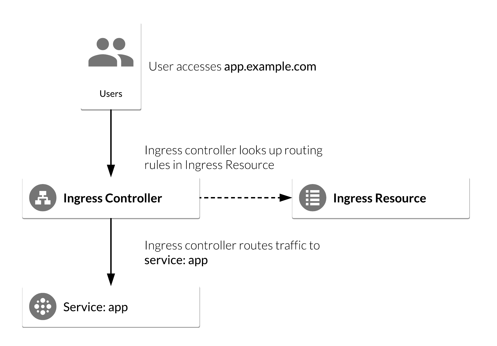

name: splash
layout: true
class: center, middle, inverse

---
count:false
# Kubernetes - Sistema Operacional Distribuido

# by [@famsbh](http://twitter.com/famsbh)

---
layout: true
count:false
name: sessao
class: left, center, inverse
#.logo-linux[]

---
layout: true
name: conteudo
count:false
class: left, top
.logo-linux[]

---
template: splash
# Dia 4

---
template: conteudo
# Agenda
- Volumes
- Network
- CI/CD

---
template: splash
# Persistindo com volumess

---
template:conteudo

# Persistent Volumes
- Container Storage Interface (CSI)
- Volumes são discos descritos no POD
- Podem ser compartilhados entre os containers dos pods
- Duram o tempo de vida do POD

.half-image[]

---
# Tipos de Volume
- Temp: emptyDir
- local: hostPath
- Net:
  - GlusterFS
  - gitRepo
  - NFS
  - iSCSI
  - AWS EBS
  - GCP PersistentDisk
  - AzureDisk
  - ...

---
# empyDir
```yaml
apiVersion: v1
kind: Pod
metadata:
  name: redis
spec:
  containers:
  - name: redis
    image: redis
    ports:
    - containerPort: 6379
    volumeMounts:
    - name: redis-data
      mountPath: /data
  volumes:
  - name: redis-data
    emptyDir: {}
```

---
# hostPath
- Monta no host corrente do POD
- Pode ser usado para logs :-(
- é um mountpoint, compartilhado entre os pods
- Não apaga quando o pod apaga

.half-image[]

---
# ConfigMap
- Permite injetar dados no pod como arquivo

```yaml
apiVersion: v1
kind: Pod
metadata:
  name: configmap-pod
spec:
  containers:
    - name: test
      image: busybox
      volumeMounts:
        - name: config-vol
          mountPath: /etc/config
  volumes:
    - name: config-vol
      configMap:
        name: log-config
        items:
          - key: log_level
            path: log_level
```

---
# AWS EBS
- Monta um EBS no container
- precisa ser provisionado antes

```yaml
apiVersion: v1
kind: Pod
metadata:
  name: test-ebs
spec:
  containers:
  - image: k8s.gcr.io/test-webserver
    name: test-container
    volumeMounts:
    - mountPath: /test-ebs
      name: test-volume
  volumes:
  - name: test-volume
    # This AWS EBS volume must already exist.
    awsElasticBlockStore:
      volumeID: <volume-id>
      fsType: ext4
```

---
# gcePersistentDisk
- Usa um GCE Persistent Disk no pod
- pode usar um disco Regional, ou seja, disponível em +1 zone

```yaml
apiVersion: v1
kind: PersistentVolume
metadata:
  name: test-volume
  labels:
    failure-domain.beta.kubernetes.io/zone: us-central1-a__us-central1-b
spec:
  capacity:
    storage: 400Gi
  accessModes:
  - ReadWriteOnce
  gcePersistentDisk:
    pdName: my-data-disk
    fsType: ext4
```

---
# NFS
- multiplos pods montando
- usa a rede

```yaml
apiVersion: v1
kind: PersistentVolume
metadata:
  name: nfs
spec:
  capacity:
    storage: 1Mi
  accessModes:
    - ReadWriteMany
  nfs:
    server: nfs-server.default.svc.cluster.local
    path: "/"
```

---
# PersistentVolume
- Gerenciado pelo cluster e não pelo POD
- Pode ser referenciado diretamente no POD
- Capacity Atualmente somente tamanho

---
# AccessMode
- ReadWriteOnce: Somente um node
- ReadOnlyMany: Varios Nodes como leitura
- ReadWriteMany: varios Nodes como Gravação
- Depende do tipo de storage
 (https://kubernetes.io/docs/concepts/storage/persistent-volumes/)

---
# Reclaim Policy
- Retail (manual Delete)
- Recycle (rm -rf)
- Delete ( volume dependente azure, gcp, aws)

---
# RawBlock (v1.13)
- AWSElasticBlockStore
- AzureDisk
- FC (Fibre Channel)
- GCEPersistentDisk
- iSCSI
- Local volume
- RBD (Ceph Block Device)
- VsphereVolume (alpha)
- (https://kubernetes.io/docs/concepts/storage/persistent-volumes/)

---
# Provisionando RAW
```yaml
apiVersion: v1
kind: PersistentVolume
metadata:
  name: block-pv
spec:
  capacity:
    storage: 10Gi
  accessModes:
    - ReadWriteOnce
  volumeMode: Block
  persistentVolumeReclaimPolicy: Retain
  fc:
    targetWWNs: ["50060e801049cfd1"]
    lun: 0
    readOnly: false
```
```yaml
apiVersion: v1
kind: PersistentVolumeClaim
metadata:
  name: block-pvc
spec:
  accessModes:
    - ReadWriteOnce
  volumeMode: Block
  resources:
    requests:
      storage: 10Gi
```
---
# Provisionando RAW

```yaml
apiVersion: v1
kind: Pod
metadata:
  name: pod-with-block-volume
spec:
  containers:
    - name: fc-container
      image: fedora:26
      command: ["/bin/sh", "-c"]
      args: [ "tail -f /dev/null" ]
      volumeDevices:
        - name: data
          devicePath: /dev/xvda
  volumes:
    - name: data
      persistentVolumeClaim:
        claimName: block-pvc
```

---
# Fases do Volume
- Mount
- Bind
- Release
- provision

---
# Mountado diretamente no POD
.full-image[]

---
# PersistentVolumeClaim
.full-image[]

---
# VolumeClass
.full-image[]

---
# Exercícios
- Provisionando Direto

```bash

gcloud compute create volume redisdb --zone {DEFZ} --size=1G
kubectl apply -f redis-disk.yaml
kubectl port-forward pod/redis 6379:6379

redis-cli
> set kubernetes K8s
> get kubernetes

# Apaga pod
kubectl get nodes -o wide
kubectl delete pod redis
kubectl cordon {node}
kubectl apply -f redis-disk.yaml
kubectl uncordon {node}
kubectl port-forward pod/redis 6379:6379
redis-cli
> get kubernetes

```

---
# Usando Volume Claim

```bash
kubectl apply -f redisdata-claim.yaml
kubectl apply -f redis-pvc.yaml
kubectl port-forward pod/redis 6379:6379

redis-cli
> get kubernetes

# Apaga pod
kubectl get nodes -o wide
kubectl delete pod redis
kubectl cordon node {node}
kubectl apply -f redis-pvc.yaml
kubectl uncordon {node}
kubectl port-forward pod/redis 6379:6379
redis-cli
> get kubernetes

```

---
#Usando Provisionamento

```bash
kubectl apply -f fast.yaml
kubectl apply -f redisdata-claim.yaml
kubectl apply -f redis-pvc.yaml
kubectl port-forward pod/redis 6379:6379

redis-cli
> get kubernetes

# Apaga pod
kubectl get nodes -o wide
kubectl delete pod redis
kubectl cordon node {node}
kubectl apply -f redis-pvc.yaml
kubectl uncordon {node}
kubectl port-forward pod/redis 6379:6379
redis-cli
> get kubernetes

```


---
template: splash
# Networking

---
template:conteudo
# Rememorando
- Host Network
- Service Network
- Pod Network

---
# Principios
- Todos os containers falam uns com os outros sem NAT
- Todos os Nodes falam com os containers sem NAT
- O ip que um container vê como o seu é o mesmo que os outros veem

---
# CNI Container Network Interface
- Modelo de rede Kubernetes
- Extensivel por plugins (https://github.com/containernetworking/cni)
- Cada vez que um pod inicia ou termina, é chamado o cni (binário)
  - Define qual o CNI a ser usado
  - liga na interface subjacente
  - Define IPs/Roteamento (IPAM)
  - Liga a interface no POD

.half-image[]

---
# Single Pod Network
.half-image[]

---
# CNI module conf
```json
 /etc/cni/net.d/10-bridge.conf
{
    "cniVersion": "0.3.1",
    "name": "bridge",
    "type": "bridge",
    "bridge": "cnio0",
    "isGateway": true,
    "ipMasq": true,
    "ipam": {
        "type": "host-local",
        "ranges": [
          [{"subnet": "${10.200.10.0"}]
        ],
        "routes": [{"dst": "0.0.0.0/0"}]
    }
}
```

---
# Plugins
- GKE:
 - Program fabric
 - Tudo da rede X > va para VM Y (label)
- Outros plugins
 - AWS: Route table
 - Weave
 - Calico
 - Flannel
 - Cilium
 .full-image-overload[]

---
# Plugins
.full-image[]

---
# Plugins
.full-image[]

---
# Service Discovery
- Services
  - Grupo de Endpoints
  - Provê um VIP
  - garante Que os endpoints estejam sãos para envio
-  Kube-DNS
  - Registro servico no DNS do cluster (nome.svc.namespace.cluster.local)
- Ambient
  - Variavel de ambiente nos pods

---
# Ingress Controller
 - Balanceador camada 7
 - Pode usar https e entregar http
 - Varias implementações
 - Na pratica, um proxy reverso escutando nodeport (todos os nodes) e um balanceador externo
 - NGINX é um dos mais usados
 - Permite os nodes ficarem privados

.half-image[]

---
# Nginx como ingress
.full-image[]

---
# ALB AWS como ingress


---
# Instalando o Nginx como ingress
 - Exercicio

helm install --name nginx-ingress stable/nginx-ingress --set rbac.create=true

---
# Network Policy

-


---
# Helm CI/CD

- Ferramenta para tratar todos os recursos de uma app como uma só unidade
- Reuso
- Agrupamento logico
- Gerenciar ciclo de vida

.half-image[]

---
# Chart
 - Metadata (chart.yaml)
 - Documentacao
 - Templates
 - Arquivo de configuracao

---
# Instalando

```bash
curl -o get_helm.sh https://raw.githubusercontent.com/kubernetes/helm/master/scripts/get
chmod +x get_helm.sh
./get_helm.sh
```

```bash
export TILLER_HOSTNAME=tiller-deploy.kube-system
export TILLER_SERVER=server
export USER_NAME=flux-helm-operator

mkdir tls
cd ./tls

# Prep the configuration
echo '{"CN":"CA","key":{"algo":"rsa","size":4096}}' | cfssl gencert -initca - | cfssljson -bare ca -
echo '{"signing":{"default":{"expiry":"43800h","usages":["signing","key encipherment","server auth","client auth"]}}}' > ca-config.json

# Create the tiller certificate
echo '{"CN":"'$TILLER_SERVER'","hosts":[""],"key":{"algo":"rsa","size":4096}}' | cfssl gencert \
  -config=ca-config.json -ca=ca.pem \
  -ca-key=ca-key.pem \
  -hostname="$TILLER_HOSTNAME" - | cfssljson -bare $TILLER_SERVER

# Create a client certificate
echo '{"CN":"'$USER_NAME'","hosts":[""],"key":{"algo":"rsa","size":4096}}' | cfssl gencert \
  -config=ca-config.json -ca=ca.pem -ca-key=ca-key.pem \
  -hostname="$TILLER_HOSTNAME" - | cfssljson -bare $USER_NAME
```

---
# Construindo um chart simples
```bash
helm create contador-sessao
```

---
# Chart
```yaml
apiVersion: v1
appVersion: "1.0"
description: A Helm chart for Kubernetes
name: contador-sessao
version: 0.1.1
```


---
# Templates
 - ingres.yaml
 - service.yaml
 - deployment.yaml

```yaml
apiVersion: v1
kind: Service
metadata:
  name: {{ include "contador-sessao.fullname" . }}
  labels:
{{ include "contador-sessao.labels" . | indent 4 }}
spec:
  type: {{ .Values.service.type }}
  ports:
    - port: {{ .Values.service.port }}
      targetPort: http
      protocol: TCP
      name: http
  selector:
    app.kubernetes.io/name: {{ include "contador-sessao.name" . }}
    app.kubernetes.io/instance: {{ .Release.Name }}
```

---
# values
```yaml
# Default values for contador-sessao.
# This is a YAML-formatted file.
# Declare variables to be passed into your templates.

replicaCount: 1

image:
  repository: fams/contador
  tag: v1beta1
  pullPolicy: IfNotPresent

imagePullSecrets: []
nameOverride: ""
fullnameOverride: ""

service:
  type: ClusterIP
  port: 5000

redis:
  service: "redis.default.svc.cluster.local"
ingress:
```

---
# exercicio

---
# Monitoramento
-
