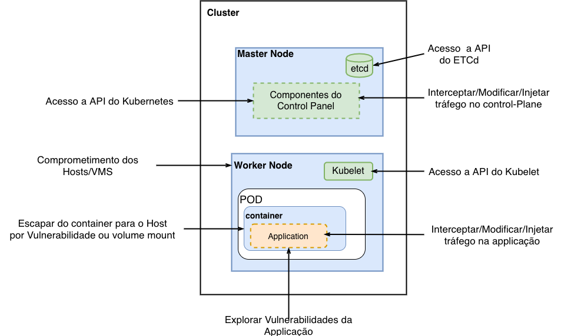
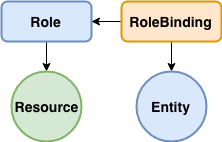
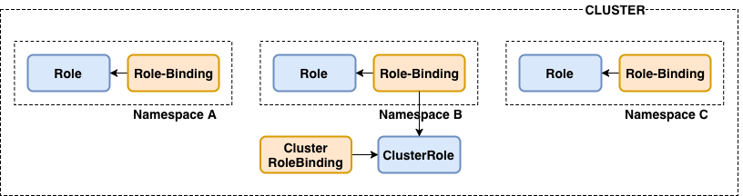

name: splash
layout: true
class: center, middle, inverse

---
count:false
# Kubernetes - Sistema Operacional Distribuido

# by [@famsbh](http://twitter.com/famsbh)

---
layout: true
count:false
name: sessao
class: left, center, inverse
#.logo-linux[]

---
layout: true
name: conteudo
count:false
class: left, top
.logo-linux[]

---
template: splash
# Introdução

---
template: conteudo
# Agenda
- Dia 5
  - Security
    - Introdução
    - Autenticação e Autorização
    - Network Policy
    - Cluster Components Security
    - POD Security
    - Node Security
    - Isolamento
    - Logging


---
template: splash
# Introdução

---
template: conteudo
# Aspectos da Segurança no Kubernetes
- Configurar o Cluster de forma segura
- Proteger a applicação
- Proteger Credenciais
- Princípios
  - Segurança em Profundidade
  - Menor Privilégio
  - Limitar a superfície de ataque

---
# Vetores de Ataque
.full-image[]

---
template: splash
# Autenticação e Autorização

---
template: conteudo
# Autenticação
- Baseado em plugins
- Token ou Password staticos
- Certificados X.509
- Webhook
- OIDC
- Bootstrap Token
- Authentication Proxy
- Webhook Token Auth


---
# Authorization Modes
- ABAC
- RBAC
- Node Authorization
- Webhook

---
template: conteudo
# RBAC
 - Entity
 - Resource
 - Role
 - Role Binding

.half-image[]

???
- Entity é um usuário, app ou qualquer coisa que queira usar o recurso
- Resource Um pod, um secret, algum recurso existente no cluster
- Role Usado para definir as permissões ce acesso a Recursos
- Role Binding Liga um Entity ao Role

---

# Tipos de Role e Binding
- Role
- ClusterRole
- RoleBinding
- ClusterRoleBinding

.full-image[]

---
# Role
```yaml
apiVersion: rbac.authorization.k8s.io/v1
kind: Role
metadata:
  namespace: web
  name: service-reader
rules:
- apiGroups: [""]
  verbs: ["get", "list"]
  resources: ["services"]
```

---
# RoleBinding
```bash
kubectl create rolebinding test --role=service-reader \
 --serviceaccount=web:default -n web
```

```yaml
apiVersion: rbac.authorization.k8s.io/v1
# permite os pods do ns web listarem os services no ns web
kind: RoleBinding
metadata:
  name: test
  namespace: web
subjects:
- kind: ServiceAccount
  name: default
  namespace: web
roleRef:
  kind: Role # Role ou ClusterRole
  name: service-reader # Deve casar com o nome da Role ou ClusterRole
  apiGroup: rbac.authorization.k8s.io
```

---
# Best Practices
-  Use RBAC!

- Desabilitar o Automount

- Use ServiceAccounts Dedicados

---
template: splash
# Proteção de rede

---
template:conteudo
# Network Policies
- Network Policies são políticas de proteção em nivel de rede e transporte semelhantes a um firewall
- Tem como pré-requisito um plugin de rede compatível (CNI)
- Permite definição de políticas padrão por namespaces e cluster

---
# Network Policies

```yaml
apiVersion: networking.k8s.io/v1
kind: NetworkPolicy
metadata:
  name: test-network-policy
  namespace: default
spec:
  podSelector:
    matchLabels:
      role: db
  policyTypes:
  - Ingress
  - Egress
  ingress:
  - from:
    - ipBlock:
        cidr: 172.17.0.0/16
        except:
        - 172.17.1.0/24
    - namespaceSelector:
        matchLabels:
          project: myproject
    - podSelector:
        matchLabels:
          role: frontend
    ports:
    - protocol: TCP
      port: 6379
  egress:
  - to:
    - ipBlock:
        cidr: 10.0.0.0/24
    ports:
    - protocol: TCP
      port: 5978
```

---
# Network Policies
- Campos obrigatórios: apiVersion, kind, e metadata

- spec: Onde efetivamente vão as regras

- podSelector: regras para agrupamento de pods que receberão as políticas

- policyTypes: Ingress, Egress ou ambos

---
# Ingress
```yaml
  ...
  ingress:
  - from:
    - namespaceSelector:
        matchLabels:
          user: alice
      podSelector:
        matchLabels:
          role: client
  ...
      ports:
    - protocol: TCP
      port: 6379
```

---
template: splash
# Cluster Components Security

---
template:conteudo
# Protegendo a API

Um usuário que possui todas as permissões de acesso à API REST equivale a um root access em qualquer máquina do cluster.

**Insecure port**
- Por default, o API Server escuta na porta 8080. Se ela estiver aberta, qualquer um pode ganhar controle total sobre o cluster inteiro. Portanto é necessário fechar essa porta com --insecure-port==0
Você pode checar se a insecure port está aberta através de um *curl*:

```bash
$ curl <IP address>:8080
```

```json
{
"paths": [
"/api",
"/api/v1",
"/apis" ]
}
```

---
# Protegendo a API

- É necessário proteger a rede que acessa o API Server usando um firewall ou uma VPN a fim de proteger o aumento da probabilidade de vazamento de informações via ataques em endpoints críticos acessados por usuários anônimos.

???
- "Enabling anonymous access to discovery endpoints could also increase the likelihood of leaking information about the software that's running on the system to an attacker"
- As configurações default do RBAC permitem acesso limitado ao API Server para usuários anônimos.

---
# Kubelet

Se usuários desautorizados podem acessar a API ou qualquer node do cluster para executar qualquer ação que seja, possivelmente tais usuários podem obter total controle do cluster. Para que isso não aconteça você pode:

- Limitar o acesso à API através de requisições autenticadas;
- Usar o controle de acesso para declinar ações desautorizadas (Access Control com RBAC).

---
# Kubelet

Especificamente, a nível de kubelet pode-se:

- Desabilitar acesso anônimo;
- Assegurar que as requisições sejam autorizadas;
- Limitar as permissões dos kubelets;
- Desligar a porta read-only. Tal porta permite que usuários desconhecidos acessem informações sobre workloads que estão rodando;
- Deployments antigos usam cAdvisor para prover métricas, porém nas versões mais novas do Kubernetes isso foi substituído. Desligar a porta do cAdvisor pode evitar a exposição de informações sobre os workloads. Se for necessário usar o cAdvisor, este deve ser usado junto a um DaemonSet;
- Cada kubelet precisa de um client certificate para se comunicar com a API. É recomendado gerar esses certificados periodicamente com --rotate-certificates.   

---
# Executando o ETCD de forma segura

Qualquer pessoa que tiver permissões read-write no ETCD pode efetivamente controlar o cluster. Permitir acessos read-only pode evitar possíveis ataques. Sendo assim, é necessário assegurar que apenas acessos autenticados serão permitidos.

- Defina <span style="color:blue">**``--cert-file``**</span> e <span style="color:blue">**``--key-file``**</span> para habilitar conexões HTTPS no ETCD;
- Defina <span style="color:blue">**``--client-cert-auth=true``**</span> para garantir que os acessos necessitarão de autenticação;
- Defina <span style="color:blue">**``--trusted-ca-file``**</span> para especificar o certificado de autoridade que assinou os cretificados dos clientes;
- Defina <span style="color:blue">**``--auto-tls=false``**</span> para não permitir a geração e o uso de certificados auto assinados;
- Defina <span style="color:blue">**``--peer-client-cert-auth=true``**</span> para que os nodes do ETCD se comuniquem entre si de forma segura;
- Defina <span style="color:blue">**``--peer-auto-tls=false``**</span> e especifique <span style="color:blue">**``--peer-cert-file``**</span>, <span style="color:blue">**``--peer-key-file``**</span> e <span style="color:blue">**``--peer-trusted-ca-file``**</span> para que haja correspondência entre as configurações do API Server e o ETDC de forma que eles se comuniquem com sucesso;
- Defina <span style="color:blue">**``--etcd-cafile``**</span> no API Server para o certificado de autoridade que assinou o certificado do ETCD;
- Especifique <span style="color:blue">**``--etcd-certfile``**</span> e <span style="color:blue">**``--etcd-keyfile``**</span> para o API Server possa se identificar para o ETCD.

---
template:conteudo
# Kubernetes Dashboard

- Permitir apenas acesso autenticado
- Usar RBAC
- Estar certo de que a *Dashboard service account* possui acesso limitado
- Não expor o seu Dashboard para uma rede pública

Recomendações de configuração do Dashboard podem ser consultadas em https://github.com/kubernetes/dashboard/wiki/Installation#recommended-setup

???

- somente usuários conhecidos podem ter acesso ao Dashboard
- limitar o acesso dos usuários através de roles para executar apenas coisas específicas
- a service account deve ter o mínimo de permissões possíveis
- Dashboard de Kubernetes não é pra expor pra internet, né, gente?! pelo amor de Deus. É pra acessar internamente. Até uma criança sabe disso.

---
template:conteudo
# Validando a configuração do cluster

Uma vez estabelecido o cluster Kubernetes é possível executar dois testes a fim de validar a segurança da configuração:

- **CIS Security Benchmark**, cujo benchmark baseia-se em uma série de recomendações para estabelecer a segurança de um deployment. O teste consiste em validar as configurações dos seus deployments em relação a esse benchmark, mesmo que você não tenha adotado todas as recomendações;

- **Teste de penetração**, no qual o teste consiste em explorar o cluster sob uma perspectiva de um hacker.

---
template:conteudo
# Para entender mais sobre os testes

**CIS Security Benchmark**
 - Benchmark for Kubernetes - https://www.cisecurity.org/benchmark/kubernetes/.
 - CIS Benchmark for Docker - https://www.cisecurity.org/benchmark/docker/.

**Penetration Testing**
 - Kube-hunter - ferramenta open source para teste de penetração especíco para Kubernetes disponível em https://github.com/aquasecurity/kube-hunter

---

template: splash
# Isolamento

---
template:conteudo
# Separando serviços críticos

- O que é crítico e sensível precisa estar separado do que não é
- Sensíveis conversam com sensíveis
- Não sensíveis conversam com sensíveis de forma controlada
- Pods devem estar isolados por segurança de credenciais entre os nodes
- Node pools, taints e tolerations devem ser adotados

???

- Se você possui serviços sensíveis que não podem ser acessados por qualquer grupo, estes devem estar isolados das outras aplicações em máquinas diferentes. Para fins de exemplificação, imagine que você tenha uma solução específica cujos serviços contêm informações críticas das quais apenas um determinado squad de desenvolvimento pode ter conhecimento e/ou acesso. Nesse caso, o recomendado é que tais serviços estejam isolados em um node pool específico com credenciais de acesso específicas apenas para esse squad, de forma que, por exemplo, apenas os desenvolvedores dele poderão fazer deploy das aplicações dessa solução. Em suma, basta criar node pools específicos com credenciais específicas para abrigar o que for crítico/sensível.
- Aplicações e microsserviços que são sensíveis devem conversar apenas com serviços que são da mesma estirpe, ou seja, devem pertencer a nodes com credenciais isoladas.
- Serviços não sensíveis podem conversar com serviços sensíveis de forma selecionada à medida que for necessário. Os não sensíveis não devem exergar, de maneira alguma, todos os sensíveis. Isso deve ser feito de forma selecionada através de um "micro-gateway" que diz: "olha, você não sensível tem permissão para chegar em tais sensíveis específicos".
- Se eu der ssh num node e acessar um pod, assim corrompendo suas credenciais, os pods estando isolados eu não consigo acessar outro node.

---
template: splash
#Bibliografia

---
# Bibliografia
- https://nvlpubs.nist.gov/nistpubs/SpecialPublications/NIST.SP.800-190.pdf
- https://kubernetes-security.info/
- https://kubernetes.io
